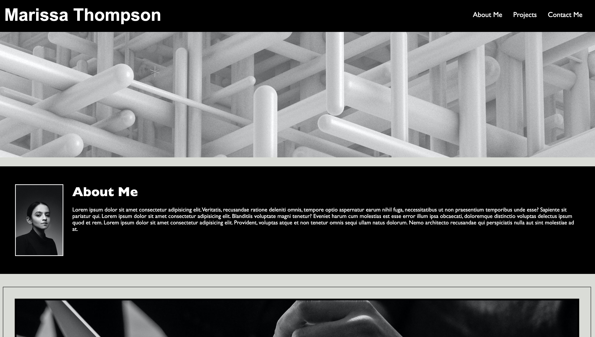

<div>


</div>

# Professional Portfolio Page

## Description

This project is a professional portfolio page, to show case my current work. This project was built using html and css. 

## Table of Contents

- [Installation](#installation)
- [Credits](#credits)
- [License](#license)

## Demo Screen Shot



## Installation

To run this portfolio locally you will need to clone this GitHub repository. Run the following command in your git bash:
```bash
git clone git@github.com:marissa424/Professional-Portfolio.git
```

## Deployed Application
https://marissa424.github.io/Professional-Portfolio/#contact-me

## Credits

Coursework from Coding Boot Camp module 1 referenced for guidance.


## License

This repository is licensed under the [MIT license](https://choosealicense.com/licenses/mit/).

---


## How to Contribute

  To suggest an idea or report a bug, please create an issue. Or, submit a pull request from your fork to the original repository for review.

